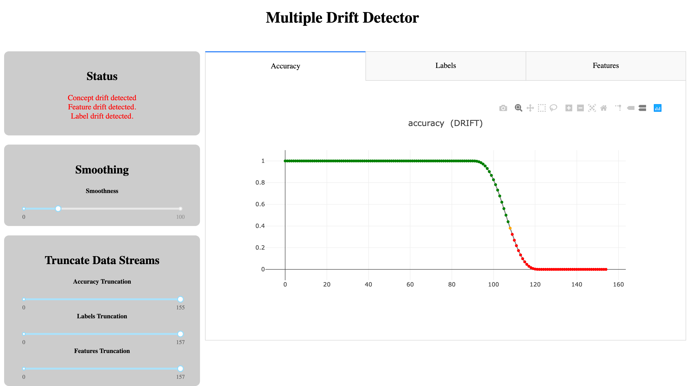

# Triage Concept Drift

This code is accompanies Hamish Huggard's [M.Sc. research](documentation/thesis.pdf) on concept drift detection for GP referrals triage.

## Contents of this Repo

- [multidriftdetector](multidriftdetector): A package for monitoring a medical triage data stream and alerting the user when concept drift occurs.
- [driftviewer](driftviewer): A Dash app for visualising the evolution the evolution of the data stream, with summaries of any drifts which have been detected.
- [tornado_mod](tornado_mod) A clone of the `Tornado` framework, which provides implementations of many concept drift detectors, extended to include some novel drift detectors. These novel detectors are:
  - [Bayesian Drift Detection Method (BDDM)](tornado_mod/drift_detection/bddm.py)
  - [Bayes with Adaptive Forgetfulness (BWAF)](tornado_mod/drift_detection/bwaf.py)
  - [Calibrated Drift Detection Method (CDDM)](tornado_mod/drift_detection/cddm.py)
- [experiments](experiments): Experiments to validate the novel drift detectors.
- [Documentation](documentation): Documenation for this research.
  - [demo.ipynb](documentation/demo.ipynb) A notebook illustrating how to use the `multidriftdetector` package.
  - [primer.ipynb](documentation/primer.ipynb) A primer on the concept drift and related terminology.
  - [SIGIR_paper.pdf](documentation/SIGIR_paper.pdf) A paper presented at the SIGIR conference on the novel CDDM detector.
  - [thesis.pdf](documentation/thesis.pdf) The M.Sc. thesis in which this code was developed.

## Background

For a primer on concept drift and related terminology, see [documentation/primer.ipynb](documentation/primer.ipynb).

It gives an introduction to the vocabulary used throughout.

## Instructions

### Environment

Step 1. Clone the package.
```
(base)$ git clone https://github.com/precisiondrivenhealth/triage_drift_detector.git
```

Step 2. Build the conda environment.
```
(base)$ cd triage_drift_detector
(base)$ conda env create -f=env.yml
```

Step 3. Activate the environment.
```
(base)$ conda activate triage_drift_env
```

Step 4. You may have to install the current module, as well as the modified Tornado submodule.
```
(triage_drift_env)$ pip install .
(triage_drift_env)$ cd tornado_mod
(triage_drift_env)$ pip install .
```

Step 4b. If the above didn't work, try this:
```
(triage_drift_env)$ rm -rm tornado_mod
(triage_drift_env)$ git clone https://github.com/precisiondrivenhealth/tornado_mod.git
(triage_drift_env)$ cd tornado_mod
(triage_drift_env)$ pip install .
```

Step 5. (Optional) If you want to use this environment in any notebooks, you will need to have `nb_conda_kernels` installed in the base environment. This will be necessary, for example, if you want to run [documentation/demo.ipynb](documentation/demo.ipynb).
```
(triage_drift_env)$ conda deactivate
(base)$ conda install nb_conda_kernels
```

### Drift Detector Usage

Step 1. Write a function to specify what should happen to messages signalling that drift has occurred.
```
>>> def send_drift_signal(signal):
  ...
```

Step 2. Specify a directory that the state of the drift detector should be recorded in.
This allows the drift detector to be restored if it is interrupted, and also allows the dash app to visualise the history of the detector.
```
>>> write_dir = './data/demo'
```

Step 3. Create a `MultiDriftDetector` object.
```
>>> detector = multidriftdetector.MultiDriftDetector(
    write_dir = write_dir,
    drift_action = display_message
)
```

Step 4. Specify the set of features and labels in the data stream
```
>>> detector.set_features(['Feature0', 'Feature1', ...])
>>> detector.set_labels(['Priority0', 'Priority1', ...])
```

Step 5. When a new instance (referral document) arrives, register it with the drift detector
```
>>> detector.add_instance([value1, value2, ...], id=...)
```

Step 6. When the model makes a new prediction, register it with the drift detector
```
>>> detector.add_prediction([softmax1, softmax2, ...], id=...)
```

Step 7. When a new ground-truth label (i.e., clinician triage label) arrives, register it with the drift detector
```
>>> detector.add_label(labelN, id=...)
```

Note that all these registration steps require an instance id.
This is so that the detector can keep track of which labels match with which predictions and which features.
This is necessary to track real drift.

For each of the registration steps, there is also an optional `description` argument
```
>>> detector.add_instance(labelN, id=..., description="...")
```
This is added to the hover-text of this data point in the graphical interface.

A detailed illustration of `MultiDriftDetector` usage is given in [documentation/demo.ipynb](documentation/demo.ipynb).

### Graphic Interface

After the drift detector has run, you can visualise the evolution of the data stream using the dash app.
The app is run as follows, where the argument is the directory that the drift detector was writing its status to.
```
(triage_drift_env)$ cd driftviewer
(triage_drift_env)$ python driftviewer.py ../data/demo
```
If you open `http://127.0.0.1:8050/` in a browser, you should see the following screen:



On the left we have three control panels:
 * __Status__ gives a summary status of the drift detector: whether any of concept drift, feature drift, or label drift have been detected.
 * __Smoothing__ lets you change the smoothness of the plots. Smoothing is achieved via a Hanning kernels, and this slider adjusts the width of the kernel as a percentage of the length of a data stream.
 * __Truncate Data Streams__ lets you cut off the last $x$% of the data stream to see how it looked previously. The three sliders let you truncate the accuracy, labels, and features streams separately.

On the right we have three tabs:
 * __Accuracy tab__ shows how the accuracy is evolving over time.
 * __Labels tab__ shows how the rate of each of the labels is evolving over time. Note that these are the labels _as predicted by the model_, not the _gold standard_ labels. Often the gold standard labels arrive later than the predicted labels, so we can get an earlier warning of label drift this way.
 * __Features tab__ shows how the values of each of the features are evolving over time. In the case of free text, it shows how the frequency of different tokens are evolving over time.

## TODO

MultiDriftDetector:
 * Handle Bonferonni corrections properly
 * Restoring from interrupt
 * Switch from accuracy to precision and recall

FeaturePreprocessor:
 * Create it
 * Handling freetext
 * Handling categorical
 * Handling numeric

README:
 * Talk about the choice of underlying drift detector

Dash app:
 * Don't hard code the contents of the dir. Read it from subdir names.
 * I think this crashes when 100% truncate accuracy.

<!--

## Conda cheatsheet

This is for my own benefit.

Create an environment with
```conda create --name <envname> python=<version> <optional dependencies>
```
And then remove it with
```
conda remove --name <envname> --all
```
Instal packages with
```
(envname)> conda install <package>
```
or
```
(envname)> pip install <package>
```
See a list of all packages with
```
conda list
```
Update the environment yaml with
```
conda env export > env.yml
```
Restore environment with
```
conda env create -f=env.yml
```
To use a conda environment in jupyter notebooks/labs, first install `nb_conda_kernels` in the base environment
```
(base)$ conda install -c conda-forge nb_conda_kernels
```
Then install `ipykernel` in the target environment
```
$ conda activate cenv
(cenv)$ conda install ipykernel
(cenv)$ conda deactivate
```
-->
