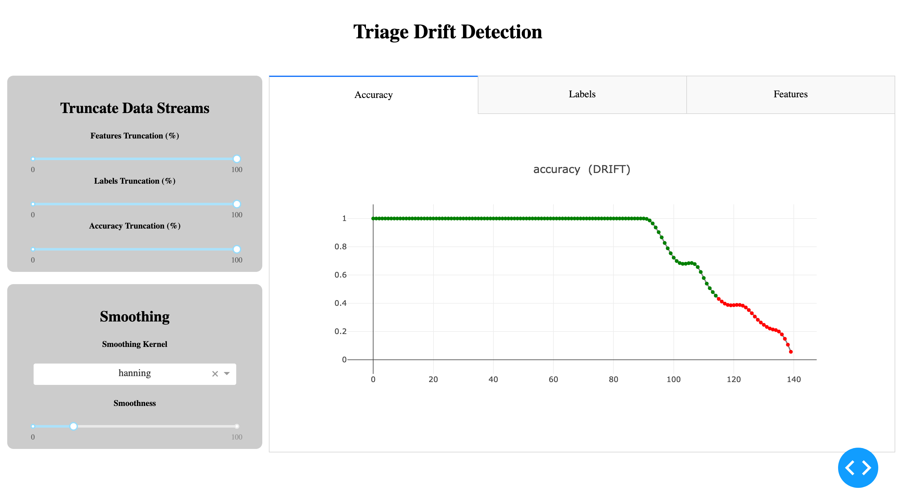

# Triage Concept Drift

A package for detecting concept drift in medical referrals triage.

## A Primer On Drift

This section has been moved to [primer.ipynb](primer.ipynb) because github doesn't like Latex in READMEs.

It gives an introduction to the vocabulary used throughout.

## Instructions

### Environment

Step 1. Clone the package.
```
(base)$ git clone https://github.com/precisiondrivenhealth/triage_drift_detector.git
```

Step 2. Build the conda environment.
```
(base)$ cd triage_drift_detector
(base)$ conda env create -f=env.yml
```

Step 3. Activate the environment.
```
(base)$ conda activate triage_drift_env
```

Step 4. (Optional) If you want to use this environment in any notebooks, you will need to have `nb_conda_kernels` installed in the base environment. This will be necessary, for example, if you want to run [demo.ipynb](demo.ipynb).
```
(triage_drift_env)$ conda deactivate
(base)$ conda install nb_conda_kernels
```

### Drift Detector Usage

Step 1. Write a function to specify what should happen to messages signalling that drift has occurred.
```
>>> def send_drift_signal(signal):
  ...
```

Step 2. Specify a directory that the state of the drift detector should be recorded in.
This allows the drift detector to be restored if it is interrupted, and also allows the dash app to visualise the history of the detector.
```
>>> write_dir = './data/demo'
```

Step 3. Create a `MultiDriftDetector` object.
```
>>> detector = multidriftdetector.MultiDriftDetector(
    write_dir = write_dir,
    drift_action = display_message
)
```

Step 4. Specify the set of features and labels in the data stream
```
>>> detector.set_features(['Feature0', 'Feature1', ...])
>>> detector.set_labels(['Priority0', 'Priority1', ...])
```

Step 5. When a new instance (referral document) arrives, register it with the drift detector
```
>>> detector.add_instance([value1, value2, ...], id=...)
```

Step 6. When the model makes a new prediction, register it with the drift detector
```
>>> detector.add_prediction([softmax1, softmax2, ...], id=...)
```

Step 7. When a new ground-truth label (i.e., clinician triage label) arrives, register it with the drift detector
```
>>> detector.add_label(labelN, id=...)
```

Note that all these registration steps require an instance id.
This is so that the detector can keep track of which labels match with which predictions and which features.
This is necessary to track real drift.

For each of the registration steps, there is also an optional `description` argument
```
>>> detector.add_instance(labelN, id=..., description="...")
```
This is added to the hover-text of this data point in the graphical interface.

A detailed illustration of `MultiDriftDetector` usage is given in [demo.ipynb](demo.ipynb).

### Graphic Interface

After the drift detector has run, you can visualise the evolution of the data stream using the dash app.
The app is run as follows, where the argument is the directory that the drift detector was writing its status to.
```
(triage_drift_env)$ cd drift_viewer
(triage_drift_env)$ python app.py ../data/demo
```
If you open `http://127.0.0.1:8050/` in a browser, you should see the following screen:



On the left we have two control panels:
 * __Truncate Data Streams__ lets you cut off the last $x$% of the data stream to see how it looked previously. The three sliders let you truncate the accuracy, labels, and features streams separately.
 * __Smoothing__ lets you change the smoothness of the plots. Smoothing is achieved via kernels, and you can adjust both the kernel shape and the width of the kernel. In layman's terms, the slider lets you adjust how smooth the kernel is.

On the right we have three tabs:
 * __Accuracy tab__ shows how the accuracy is evolving over time.
 * __Labels tab__ shows how the rate of each of the labels is evolving over time.
 * __Features tab__ shows how the values of each of the features are evolving over time. In the case of free text, it shows how the frequency of different tokens are evolving over time.

## TODO

General:
 * Make sure notebook still works with name changes

MultiDriftDetector:
 * Restoring from interrupt
 * Incorporate CDDM
 * Incorporate Bayes
 * Handling freetext
 * Handle Bonferonni corrections properly

README:
 * Describe the contents of the repository
 * Talk about the choice of underlying drift detector

Dash app:
 * Central display of all drifting streams
 * Add comments explaining how everything works

<!--

## The Contents of this Repo


### MediTornado

A fork of the Tornado framework with the following additions:
 * An implementation of the CDDM algorithm
 * Data stream generators for medical data based on the MIMIC-III dataset
Note that this is a git [submodule](https://git-scm.com/book/en/v2/Git-Tools-Submodules) with its own repository.

## Conda cheatsheet

This is for my own benefit.

Create an environment with
```conda create --name <envname> python=<version> <optional dependencies>
```
And then remove it with
```
conda remove --name <envname> --all
```
Instal packages with
```
(envname)> conda install <package>
```
or
```
(envname)> pip install <package>
```
See a list of all packages with
```
conda list
```
Update the environment yaml with
```
conda env export > env.yml
```
Restore environment with
```
conda env create -f=env.yml
```
To use a conda environment in jupyter notebooks/labs, first install `nb_conda_kernels` in the base environment
```
(base)$ conda install -c conda-forge nb_conda_kernels
```
Then install `ipykernel` in the target environment
```
$ conda activate cenv
(cenv)$ conda install ipykernel
(cenv)$ conda deactivate
```
-->
